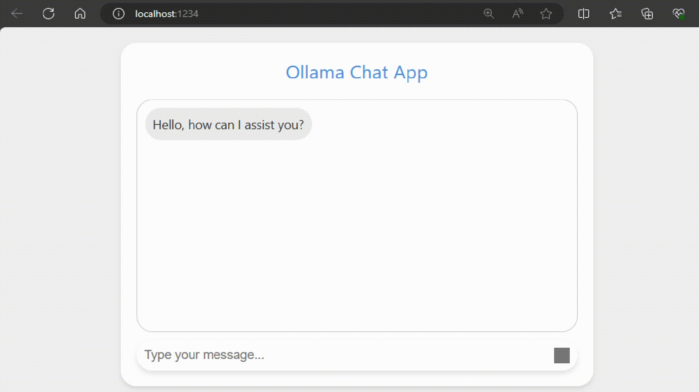

# Ollama Chat app

Very simple JavaScript Chat app to connect to locally hosted Ollama API.



## Setup

1. Setup Ollama locally (follow the steps here https://twitter.com/juanstoppa/status/1773130499357130889)
2. Clone repo
3. Run npm install

```bash
npm install
```

4. Install Parcel

```
npm install -g parcel-bundler
```

4. Run app

```bash
parcel src/index.html
```
